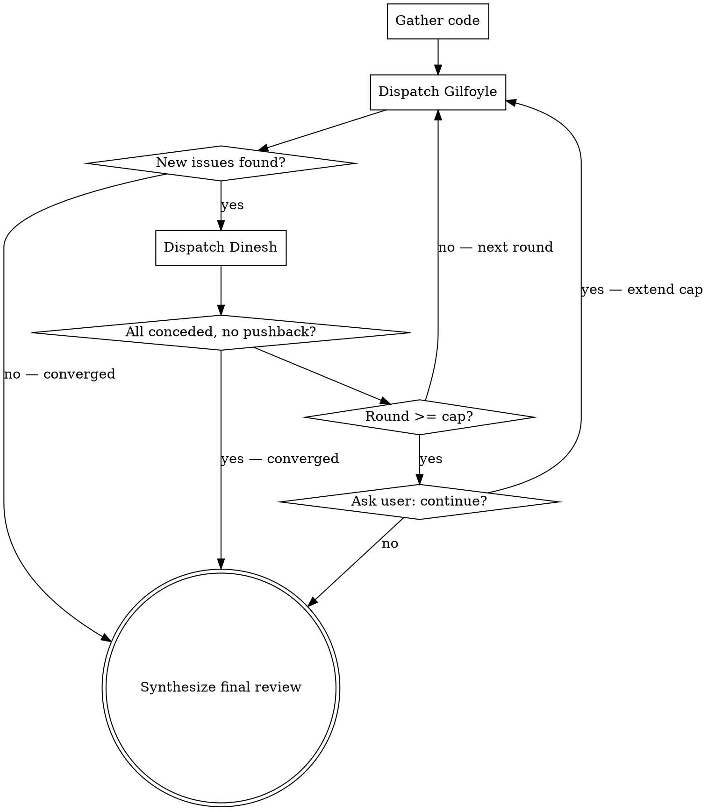

 
# Dinesh vs Gilfoyle Code Review
 
Two-agent adversarial code review inspired by HBO's Silicon Valley. Gilfoyle attacks the code with withering technical precision. Dinesh defends it with flustered competence. The banter entertains; the back-and-forth produces genuinely better reviews.
 
## Invocation
 
```
/dg                              → review local git diff (staged + unstaged)
/dg 3                            → local diff, max 3 rounds
/dg src/auth.ts                  → review specific file
/dg src/auth.ts 3                → specific file, 3 rounds
 
/dg --pr my-feature              → review PR branch vs main
/dg --pr my-feature 3            → PR branch, 3 rounds
/dg --pr my-feature src/auth.ts  → PR branch, scoped to a path
/dg --pr my-feature src/ 3       → PR branch, scoped path, 3 rounds
```
 
## Parse Arguments
 
Strip `--pr <branch>` first if present, then apply existing rules to the remainder:
 
1. No remaining args → target = git diff/PR diff (full), cap = 5
2. Number only → target = full diff, cap = that number
3. Path only → target = scoped to that path, cap = 5
4. Path + number → target = scoped path, cap = number
**Mode:** `local` if no `--pr` flag; `pr` if `--pr <branch>` is present.
 
## Orchestration
 
### Step 1: Gather Code
 
#### Local mode (no --pr flag)
 
```bash
git diff HEAD
git diff --staged
```
 
Combine both diffs. If both are empty, tell the user there's nothing to review.
 
#### PR mode (--pr \<branch\>)
 
**Auto-detect the base branch:**
```bash
git symbolic-ref refs/remotes/origin/HEAD 2>/dev/null | sed 's@^refs/remotes/origin/@@'
```
If this fails (e.g. no remote configured), fall back to `main`. Tell the user which base branch you're using.
 
**Gather the PR diff using merge-base (three-dot) syntax** — this diffs the common ancestor against the PR tip, so you only see what the PR actually changed regardless of how far the base has moved:
 
```bash
# Commit narrative — Gilfoyle will use this to roast intent vs. execution
git log <base>..<branch> --oneline
 
# Scope overview
git diff --stat <base>...<branch>
 
# Structured file list (M=modified, A=added, D=deleted, R=renamed)
git diff --name-status <base>...<branch>
 
# Full diff — feed this to agents (scope to path if user passed one)
git diff <base>...<branch>
# or if scoped:
git diff <base>...<branch> -- <path>
```
 
Note: `git log` uses two dots (commits on the branch not yet on base). `git diff` uses three dots (diff from merge-base to branch tip). This is intentional.
 
If the diff is empty (branch is up to date with base), tell the user and stop.
 
**Build the PR context block** to prepend to agent dispatches:
```
Review mode: PR (branch: <branch> → <base>)
Commits in this PR:
  <git log output>
```
 
This gives Gilfoyle commit message context — he will use it.
 
#### Both modes: Gather dependency context
 
Look for dependency files in the project root and include them in agent context:
- `package.json`, `package-lock.json`, `yarn.lock`, `pnpm-lock.yaml` (Node.js)
- `requirements.txt`, `pyproject.toml`, `Pipfile.lock` (Python)
- `go.mod`, `go.sum` (Go)
- `pom.xml`, `build.gradle` (Java)
- `Gemfile`, `Gemfile.lock` (Ruby)
- `Cargo.toml`, `Cargo.lock` (Rust)
- `composer.json`, `composer.lock` (PHP)
These are needed for Gilfoyle's dependency vulnerability scan.
 
### Step 2: Run the Debate
 
Initialize: `round = 0`, `debate_history = []`
 

 
**Each round:**
 
1. **Dispatch Gilfoyle agent** (Agent tool, general-purpose) with:
   - Full content of `gilfoyle-agent.md` from this skill's directory
   - The code under review
   - Full debate history
   - Round number
   - PR context block (if PR mode — include commit history so he can roast the narrative)
   - Instruction: "You are doing research only — read the code and produce your review. Do NOT edit any files."
2. **Display Gilfoyle's banter** to the user.
3. **Check convergence:** Parse Gilfoyle's FINDINGS section. If all findings are repeats from previous rounds → converge.
4. **Dispatch Dinesh agent** (Agent tool, general-purpose) with:
   - Full content of `dinesh-agent.md` from this skill's directory
   - The code under review
   - Gilfoyle's latest full response
   - Full debate history
   - Round number
   - PR context block (if PR mode)
   - Instruction: "You are doing research only — read the code and produce your defense. Do NOT edit any files."
5. **Display Dinesh's banter** to the user.
6. **Check convergence:** Parse Dinesh's FINDINGS section. If every point is `[concede]` with zero `[defend]` or `[dismiss]` → converge.
7. **Append both responses to debate_history**, increment round.
8. **If round >= cap:** Ask user: *"These two could go all night. Continue for more rounds? (y/N)"*
   - Yes → extend cap by original amount, continue loop
   - No → proceed to synthesis
**Convergence announcements** (pick one that fits):
- "Gilfoyle has run out of things to hate. Unprecedented."
- "Dinesh has conceded defeat. As expected."
- "These two are going in circles. Separating them before it gets physical."
### Step 3: Synthesize Final Review
 
After the debate ends, produce a structured summary from the full debate transcript.
 
**Display format:**
 
```markdown
## Dinesh vs Gilfoyle Review — [target]
### [N] rounds of mass destruction
 
---
### Best of the Banter
[2-4 of the funniest or most insightful exchanges from the debate]
 
---
 
### Verdict
 
#### Critical (Gilfoyle won, Dinesh conceded)
[Issues where Dinesh couldn't mount a defense — these are real and need fixing]
- `file:line` — issue — fix
 
#### Important (Gilfoyle won after debate)
[Issues Dinesh tried to defend but Gilfoyle's argument was stronger]
- `file:line` — issue — fix
 
#### Contested (Dinesh held his ground)
[Issues where Dinesh's defense was valid — code is likely fine]
- `file:line` — what was raised — why the defense holds
 
#### Dismissed (Gilfoyle was nitpicking)
[Issues both sides agree don't matter]
- `file:line` — what was raised — why it's a non-issue
 
### Strengths
[Things even Gilfoyle grudgingly acknowledged were good]
 
### Score
Gilfoyle: X | Dinesh: Y
[Tongue-in-cheek tally of who won more arguments]
 
### Recommended Changes
[Clean checklist — no banter, no context, just what to do]
- [ ] `file:line` — what to change
- [ ] `file:line` — what to change
- [ ] ...
 
If no changes needed: "Nothing to fix. Gilfoyle is furious."
```
 
**In PR mode**, append a merge recommendation after the checklist:
 
```markdown
### Merge Verdict
[One of: "Ship it.", "Fix the criticals first.", "Do not merge. Gilfoyle wins."]
[One sentence rationale.]
```

## Key Principles
 
- **The banter is the feature, not decoration** — it keeps reviews entertaining and thorough
- **Dinesh's concessions are the strongest signal** — when he can't defend, it's a real issue
- **Successful defences validate code** — if Dinesh can justify it under Gilfoyle's assault, it's solid
- **Always end with an actionable summary** — fun on the outside, useful on the inside
- **Be technically correct** — the humor only works if the technical substance is real
- **Three-dot diffs, always** — when reviewing a PR, always use `git diff base...branch` (merge-base diff) so agents only see what the PR actually changed, not drift from the base branch
 
